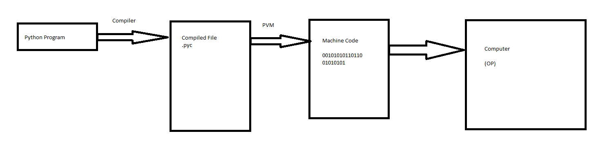

Lab(Lecture)

# Features of python
- Simple
- Easy to learn
- Open Source
- High Level Language
- Dynamically Typed
- Platform Independent
- Portable

Simple: Python is a simple programming language. When we read python program, we feel like reading english sentences. Hence understanding and developing programs become easy.

Easy to learn: The structure of python program is very simple. Python uses very few keywords. Hence learning and developing programs in python becomes easy.

Open Source: Python is freely available from https://www.python.org, can be downloaded and installed.  There is no need of paying anything for using python.

High level language: Programming languages are of two types: Low Level And High Level. A low level language use machine code instructions to develop a program. Python is a high level programming language as it uses english words to develop a program.

Dynamically Typed: In python we need not a declare anything. An assignment statements binds a name to a object and the object can be of any type.

Platform Independent: After the compilation of the program it generates byte code. The byte code is fixed set of instructions that runs on all operating systems.

Portable: As we know that python code are platform independent, Its code will give same result in any computer in the world


# Execution of Python Program

Suppose that we have a python program named first.py. Here 'first' is the program name and '.py' is the extension. After writing the code, the next step is to compile the code. The compiler will convert the python program into the byte code. Byte code represents a fixed set of instructions that represents all operations, which run on any operating system and hardware. It means that bytes instructions are system independent and platform independent. The computer cannot execute the byte code so it is necessary to convert byte code to machine code. PVM (Python Virtual Machine) interprets the byte code and convert it to the machine code..

`Image Here`


<!-- python compiles are
    1) CPython - Standard compiler
    2) PyPy -->

normally after compiling the code the .pyc file is generated. That is converted to machine code using PVM. But we can not see .pyc file because it is done internally. If you want to create .pyc file we must use following command

```console
python -m py_compile fileName.py
```

-m option in the above command represents the module of py_compile. This will generate .pyc file for us. C Python in the name of .pyc file indicates that we are using python compiler that was created using c language. The compiler created by c language is considered as a standard compiler. You can run .pyc file using the name of file with extension .pyc. 

### Viewing the byte code
```console
python -m dis fileName.py
```