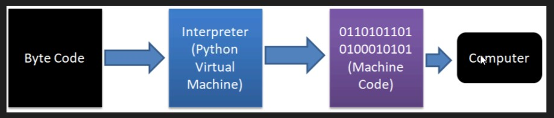

Lab(Lecture)

# Python Virtual Machine

- Since computer understands only machine code, it is obvious that we should convert any program into machine code before it is submitted to the computer for execution.

- A compiler normally converts the program source code into machine code.

- Python compiler does the same task but in a slightly different manner. It converts the program source code into byte code(In the .pyc Format)

# 

#

- The role of PVM is to convert the byte code instructions into machine code so that the computer can execute those machine code instructions and display the final output.

- A PVM is equipped with an interpreter which converts the byte code into machine code and sends it to the computer processor for execution.

- Since an interpreter plays an important role, often a PVM is also known as interpreter.

# Memory

