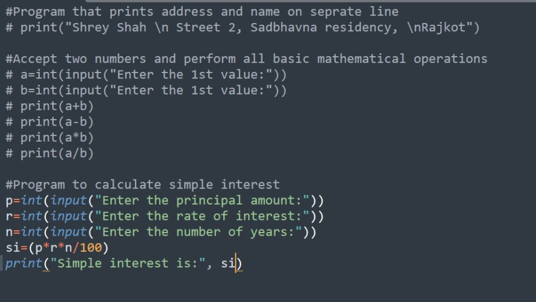

Lab(Lecture)

# Memory Management

- In the programming languages like C, C++ programmers needs to allocate and de-allocate memory during runtime.

- In python allocation and de-allocation are done automatically.

- Python's PVM will take care of such issues.

- IMP: A python considers string, list, function, and even modules as an object.

- The memory manager inside the PVM allocates memory required for objects created in a Python program.

- All these objects are stored in the separate memory called a heap.

- Heap is the memory which is allocated during run time.

- The size of heap memory depends on the RAM, which can increase or decrease it's size depending upon the requirement of program

- The operating system will help to allocate the memory in the RAM.

- A row memory allocator look after whether memory is available for storing objects.

- On the top of row memory allocator there are several object specific allocators which operates on same heap.

- These object specific allocators do the task of memory management depending upon types of objects.

# Comparison Between Java And Python

| No. | Java    | Python    |
| :---:   | :--- | :--- |
| 01 | Java is object oriented programming language. Functional programming features are introduced into Java 8.0   | Python have the functional programming with object oriented feature |
| 02 | Java Code requires more number of lines                                                                      | Python programs are concise and compact |
| 03 | It is compulsory the declare the data types of variables, array, etc in java                                 | Type declaration is not required in python |
| 04 | Java Has Do while, While, for, foreach loops                                                                 | Python has while and for loops |
| 05 | Java has switch statements                                                                                   | Python does not have switch statements |
| 06 | Memory allocation done by automatically by JVM                                                               | Memory allocation done by automatically by PVM |
| 07 | Java supports single and multi-dimensional arrays                                                            | Python supports only single dimensional array. To work with multi dimensional array we should use third party applications like 'numpy'. |
| 08 | The array index should be a positive Integer.                                                                | The array index can be positive or negative Integer number. Negative integer number represents location from the end of the array. |
| 09 | A semicolon is used to terminate the statements and coma is used to separate expressions.                    | New line indicates the end of the statements and semicolon is used as an expression separator. |
---

