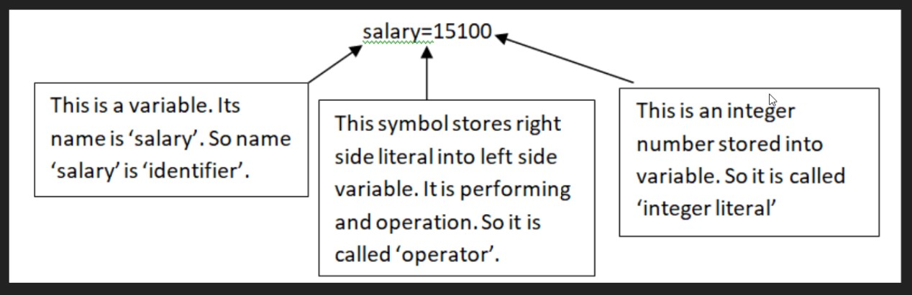

## Lab (Lecture)

# Constants in Python
-  A constant is similar to a variable but its value cannot be modified during program execution
- Value of normal variable can be changed when required, which is not possible for a constant
- Once defined a constant value not allowed to change
- For example 'pi' in mathematics is 22/7 which never changes
- Python does not allow creating constant value
- A programmer can indicate a variable as constant by writing its name in Capital letters. For example 'MAX_VALUE' is a constant
- But its value can be changed

# Identifiers in Python
- An identifier is a name that is given to a variable, function or a class
- Identifiers can include letters, numbers and underscore ( _ )
- Identifiers should not starts with numeric values
- Use of others special characters is not allowed
- A python is a case sensitive language

```python
    a = 16
    A = 16
    # Above both variables is different
```



<style>
    body{
        zoom: 130%
    }