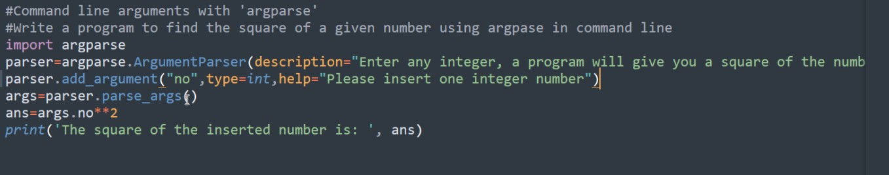

## Lab (Lecture)

# Command line arguments:

---

By Abhay Vachhani

---

- Note: CMD and PowerShell will give different output while we give following input as an argument using command line argument '"'4'"'

- Use encode( ) to print its actual data

---

- We can write a program which can accept the values while we are running the program in the command prompt
- Command line arguments are the arguments which are passed to the program from outside the program
- Arguments must be entered by keeping white space between them
- The arguments passed at the command line are by default stored in the form of list with the name 'argv' which is the part of 'sys' module.

```python
    import sys

    print(sys.argv)
    
    # Write a program to display the name of file
    print('The file name is', sys.argv[0])

    # Write a program to accept two values from the users at command line and add them.

    a = int(sys.argv[1])
    b = int(sys.argv[2])

    print('The sum of a and b is:', a + b)
```

# Command line arguments with argparse:

- The 'argparse' module in Python is useful to develop user friendly programs using command line arguments
- The 'argparse' module generates help and usage messages When user gives program invalid arguments.
- It may also display an error messages to the user
- To work with 'argparse' module we must import it as 'import argparse' 
#### Wrong: - if 'argparse' is not installed then install it using command 'pip install argparse' in the command prompt

---
- To work with 'argparse' module it is necessary to import it as
```python
    import argparse as ap
```
- Then we should create an object of 'ArgumentParser' class object with description of the program
```python
    parser = ap.ArgumentParser(description='Enter any integer value, Program will give you the square of it')
```
- The next step is adding arguments to the parser using add_argument() method
- A program may have one or more arguments that are to be inputted by the user at the time of running a program
```python
    parser.add_argument('no', type=int, help='Please insert one integer number')
```
- In the above statement 'no' represents the variable where argument is stored. type = int means user can enter only integer value, help represents help message displayed to the user
- The parser (Go Through) will parse the arguments provided by the user
- These arguments are received by parse_args() method as 
```python
    args = parser.parse_args()
```

