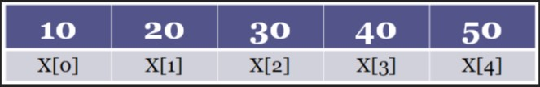
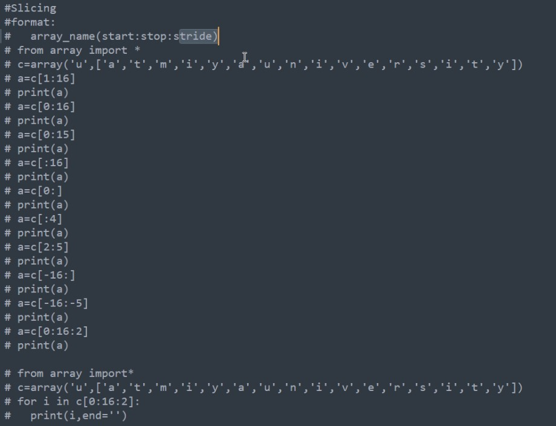

## Lab (Lecture)

# Indexing and slicing:

## Indexing:
- An index represents the position number of elements in the array.

- For example when we create the array like this

```python
    a = array('i', [10,20,30,40,50])
```

- Python Interpreter allocates 5 blocks of memory



- Here 0, 1, 2, etc... are representing the position numbers of the elements.

- So in general we can use 'i' to represent the position of any element.

- This 'i' is called index of the array


## Slicing:

- A slice represents a piece of the array 

- Slicing is useful to retrieve a range of elements

- The general formate of a slice is array_name[start:stop:stride]

- We can eliminate any one or any two from above three

