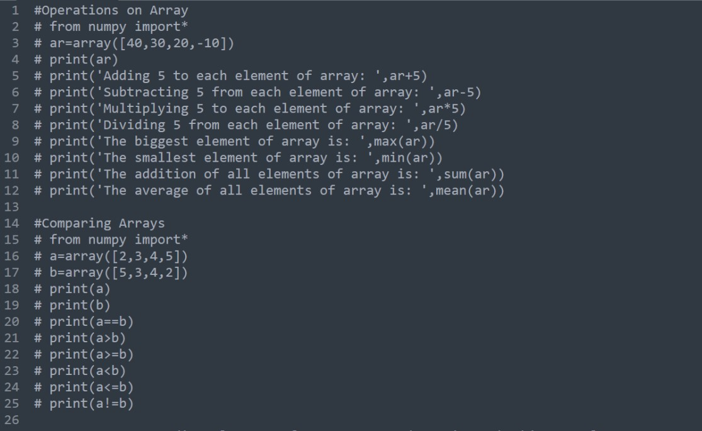
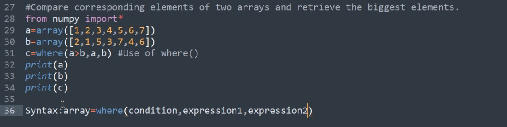

## Lab (Lecture)

Date: 21-04-2023

# Operations on Array




- The where function can be used to create a new array based on wether a given condition is True of False

- The syntax of the where function is

```python
    array: np.where(condition, expression1, expression2)
```

- The use of where function is demonstrated in the above example

## The nonzero function:

- The non-zero function is used to retrieve the non zero elements from the array

```python
    a = np.array([1,2,0,3,4])
    b = np.nonzero(a) # return index of an elements which is non-zero
    print(a)
    print(b)
    print(a[b])
```

## 

```python
    a = np.array([1, 3, 4, 6])
    b = a.view()

    print(a)
    print(b)

    b[2] = 300

    print(b)
    print(a)
    
    a[3] = 400

    print(a)
    print(b)
```

- A view function create another array same as an existing array

- The original array and the newly created array will share different memory locations

- If the newly created array is modified, the original array will also be modified and vice-versa

- view function creates a copy which is known as 'Shallow Copying'

- The use of view function is demonstrated in the above program

<!-- Leave 1 line -->

- In case we want both arrays but modifying one array must not have an effect on another array then we may use copy() function

- The use of copy function is demonstrated in the below program

