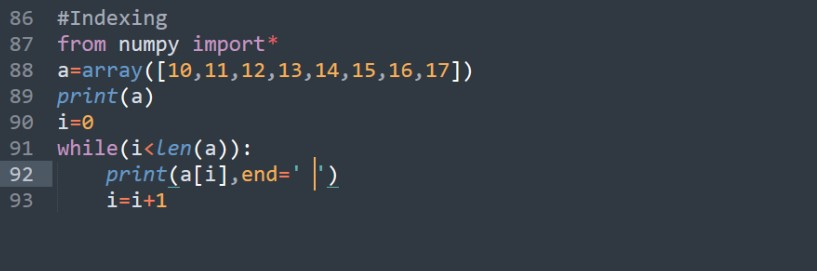

## Lab (Lecture)

Date: 21-04-2023

# Slicing and Indexing Numpy Arrays:

## Slicing:

- Slicing refers to extracting a range of elements from the array.

- The format of slicing operation is as below

Syntax:

```python
    arrayName[start:stop:stepSize]
```

- Here the default value of 'start' is 0, for 'stop' it is 'n' (Number of Elements), 'stepSize' is 1

- Counting starts from 0<sup>th</sup> position


## Indexing:

- Indexing refers to the locations of the element

- By specifying the location numbers from zero onwards till n-1, we can refer to all elements as a[i] where 'i' can change from 0 to n-1



# Attributes of an Array:

#. ndim Attribute

#. shape Attribute

#. size Attribute

#. dtype Attribute

#. reshape( ) Method

#. flatten( ) Method

---

## 1. ndim Attribute:

- The ndim attribute represents the number of dimensions of the array

- For the single dimensional array it will display 1 and for two dimensional it will display 2

```python
    import numpy as np

    a = np.array([1, 2, 3])
    b = np.array([a, a])
    c = np.array([b, b, b])

    print(a.ndim, b.ndim, c.ndim)
```

## 2. The shape Attribute:

- The shape attribute gives the shape of an array

- The shape is a tuple listing the number of elements along each dimensions


## 3. The size Attribute:


- The size attribute gives the total number of elements in the array

## 4. The dtype Attribute:

- The dtype attribute gives the datatype of array elements


## 5. The reshape( ) Method:

- The reshape method is used to change the shape of an array


## 6. The flatten( ) Method:

- The flatten () method is used to collapse the elements of an array into one dimensional array


D:\AB is a Programmer\Abhay\MCA 2\Python\2023-04-26