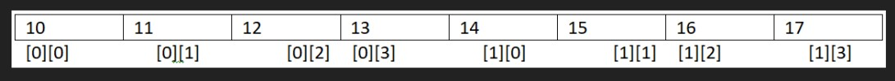

## Lab (Lecture)

Date: 28-04-2023

# Multi dimensional arrays

- The 2D arrays, 3D arrays, etc are called multi dimensional arrays

```python
    import numpy as np
    a = np.array(
        [
            [
                10, 11, 12, 13
            ],
            [
                14, 15, 16, 17
            ],
        ]
    )

    print(a)
```

- The internal memory allocated to all the elements would be in a single row containing 8 blocks (As there are eight elements in the array)

- The elements are stored in contiguous memory location as shown below



# The reshape( ) function:

- This function is useful to convert a 1D array into a multi dimensional array

- It would be written as below
    
    np.reshape(arrayName, (n, r, c))

- Here 'n' represents number of array in the output, 'r' represents row and 'c' represents number of columns

```python
    import numpy as np

    a = np.array(list(range(1, 12 + 1)))
    print(a)

    b = np.reshape(a, (3, 4))
    print(b)

    b = np.reshape(a, (2, 3, 2))
    print(b)
```

# Indexing in multi dimensional arrays:

- Index represents the location numbers

- The individual arrays of 2D arrays can be access by specifying the location number of the row and column of the element in the array as 

    - a[0][0] it represents 0<sup>th</sup> row and 0<sup>th</sup> column in the array
    - a[1][3] it represents 1<sup>st</sup> row and 3<sup>rd</sup> column in the array

```python
    import numpy as np

    a = np.array([
        [1, 2, 3],
        [4, 5, 6],
        [7, 8, 9],
    ])

    for i in range(len(a)): # For rows
        for j in range(len(a[i])): # For columns
            print(a[i][j], end=' ')
```

# Slicing in Multi dimensional arrays:

```python
    import numpy as np

    a = np.array([
        [1, 2, 3],
        [4, 5, 6],
        [7, 8, 9],
    ])

    print(a[0, : ])
```