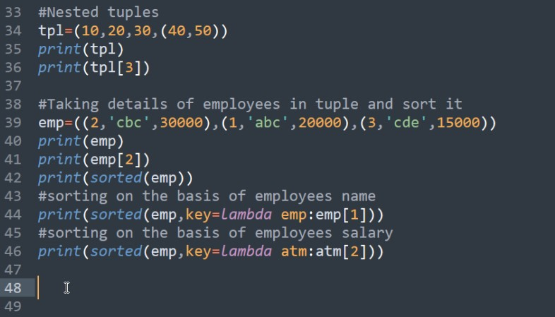
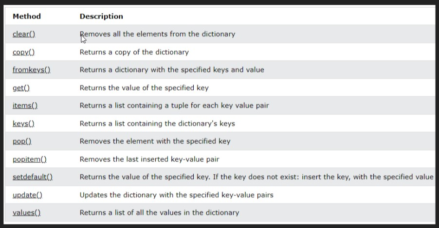

## Lab (Lecture)

Date: 03-05-2023

# Nested Tuples



<!-- Extra -->
# Dictionary:

- A dictionary represents a group of elements arranged in a form of key-values pairs

- In the dictionary, first element is considered as 'key' and immediate next value is considered as its 'value'

- We cannot use slicing or indexing to retrieve elements from dictionary



# Sorting the elements of a dictionary using lambda:

- A lambda is a function that does not have a name and can be written without 'def'

- They are used to perform some calculations or processing easily

```python
    x = lambda x, y : x + y
```

- There are two arguments in the function named x and y, After colon we wrote the body i.e.(that is) x + y This is the value returned by the lambda function

