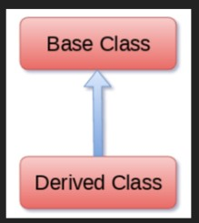

# Unit 5: Object Oriented Programming

# Classes and Objects

## Introduction of Class:

- We write a class with the attributes and actions of objects

- Attributes are represented variables and actions are performed by methods

- So a class contains variables and actions

- Classes in python are built from a single super class called 'object'

- If a programmer creates his own classes, by default object class will become super class for them internally

- The difference between function and method is that the function written inside a class is called method

- The general format of a class is as below:

```python
    class ClassName(object):
        attributes = 0
        ...

        def __init__(self):
            ...
        
        def method1():
            ...
        
        def method2():
            ...

        ...
```

- Please note that writing 'object' after class name is not compulsory

- Example:

```python
    # Program to create a class and display values

    class Person:
        def __init__(self, name, age):
            self.name = name
            self.age = age
    
    p = Person('Abc', 16)
    print(p.name)
    print(p.age)
```

- In the above example 'Person' is the name of class

- Name of class is generally written in capital letters

- '\_\_init\_\_' is a special method which is useful to initialize variables internally

- An init have two underscores before and after which indicates that this method is internally defined and we cannot call this method explicitly

- The parameter 'self' is written after the method name

- 'self' is the variable that refers to current class instance

- When we create an instance of class 'Person', a separate memory block is allocated on the heap and that memory location is by default stored in 'self'


# Inner Class:

- Writing a class within another class is called an inner class or nested class

- If write class 'B' inside class 'A', then 'B' is called inner class

- For example lets take persons data like name, contact, date of birth, etc...

- Here name, contains single value like 'Abhay', contact may have single value like '9999999999' but date of birth does not have a single value

- It has date, month, and year so we need to take these three values as a subgroup

- It would be batter to write a separate class for date of birth inside the person class

```python
    class A:
        class B:
```

# Inheritance:

- Inheritance is an important aspect of the object oriented paradigm

- Inheritance provide code reusability to the program because we can use an existing class to create a new class instead of creating it from scratch



- In inheritance, the child class acquires the properties and can access all the data members and functions defined in the parent class

- A child class can also provide its specific implementation to the function of parent class

# Constructors in Inheritance:

- 

# The super () method:

- Any constructor written in the super class is not available to the sub class if the sub class itself has the constructor

- This is done by calling the super class constructor using the super () method

- super () method is a built in method which is useful to call the super class constructor or methods from the sub class

- super method contains the history of super class methods

```python
    # Format
    super().__init__()
    super().__init__(args)
```