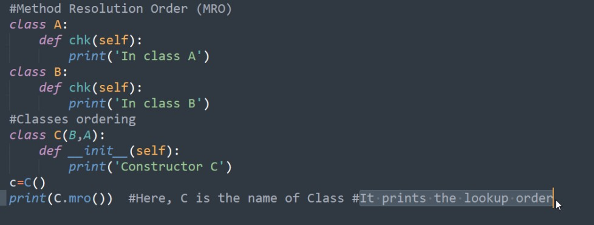

# Types of Inheritance

- The main advantage of inheritance is code reusability

- The members of the super class are reusable in the sub class

- There are mainly 2 types of inheritance

- 1. Single Inheritance
- 2. Multiple Inheritance

## 1. Single Inheritance:

- A single inheritance enables a derived class to inherit properties from a base class, thus enabling code reusability and the addition of new features to existing code


## 2. Multiple Inheritance:

- Deriving sub classes from multiple base classes is called multiple inheritance

- In this type of inheritance, there will be more than one super classes and there may be one or more sub classes


# Method Resolution Order (mro):

- In multiple inheritance scenario, any specified attribute or method is searched first in the current class if not found, the search continues into parent class in depth first, left to right fashion without searching the same class twice searching in this way is called Method Resolution Order

- MRO follows three principles 
    1. Search for the sub class before going to its base classes

    2. When a class is inherited from several classes, it searches in order from left to right

    3. It will not visit any class more than once



- MRO prints the lookup order


# Polymorphism:

- The word polymorphism means having many forms

- In programming polymorphism means the same function name (but different signatures) being used for different types

- The key difference is that the datatypes and number of arguments used in the function

- To understand lets take an example of wheat flour

- Using wheat flour we can make rotis, bread, paratha, etc...

- The wheat flour is same but we can use it in different forms

- If a variable, object or method demonstrates different behavior in different context, it is called polymorphism

- Following topics are examples of polymorphism in Python

    1. Duck Typing Philosophy
    2. Operator Overloading
    3. Method Overloading
    4. Method Overriding

## 1. Duck Typing Philosophy:

- The datatype of variables does not need to explicitly declare

- The type is implicitly assigned depending upon the purpose for which the variable is used

- Example:

```python
    a  = 'Atmiya'
    print(a, type(a))

    a = 7
    print(a, type(a))
```

```python
    # Program to invoke a method on an object without knowing the type of the object
    class Duck:
        def speak(self):
            print('Quack quack')
    
    class Human:
        def speak(self):
            print('Namaste')
    
    def call_speak(obj): # This method accepts an object and calls speak() method
        obj.speak()
    
    # Calling the call_speak() method and pass an object
    # depending upon the type of object, speak() method is executed
    a = Duck()
    call_speak(a)
    a = Human()
    call_speak(a)

```

## 2. Operator Overloading:

- An operators like plus, multiplication, minus, division, etc... is a symbol that performs some actions

- As we know that '+' is an operator performs addition when used on numbers

- When '+' operator is used on string then strings are concatenated

- When an operator performs different actions it is said to be operator overloading

- Example:

```python
    a = 10
    b = 6

    print(a + b) # Using '+' to add two numbers

    str1 = 'New '
    str2 = 'Delhi'

    print(str1 + str2) # Using '+' to concatenate two strings

    lst1 = [1, 22, 3]
    lst2 = [11, 22, 33]

    print(lst1 + lst2) # Using '+' to concatenate two lists
```


## 3. Method Overloading:

- If a method written such that it can perform more than one task, it is called Method Overloading

- Method overloading is not available in python

- In python we can achieve method overloading by writing same method with several parameters

- The method performs the operation depending on the number of arguments in the method call

- Example:

```python
    class Add:
        def sum(self, a = None, b = None, c = None):
            if a and b and c:
                print('Sum of 3 numbers:', a+b+c)
            elif a and b:
                print('Sum of 2 numbers:', a+b)
            else:
                print('Please enter atleast 2 numbers')
    Add().sum(10, 20, 30)
    Add().sum(10, 20)
    Add().sum(10)
    Add().sum()
```

## 4. Method Overriding:

- When there is a method in the parent class, writing the same method in the child class so that it replaces the parent class method is called method overriding

- The programmer overrides the super class method when he does not want to use them in sub class

- Instead he wants new functionality to the same method in the sub class

- Example:

```python
    # Program to find area of square and circle
    from math import pi
    class Square:
        def area(self, a):
            print('The area of a square is:', a**2)

    class Circle(Square):
        def area(self, a):
            print('The area of a circle is:', pi*a**2)

    c = Circle()
    c.area(10)
```